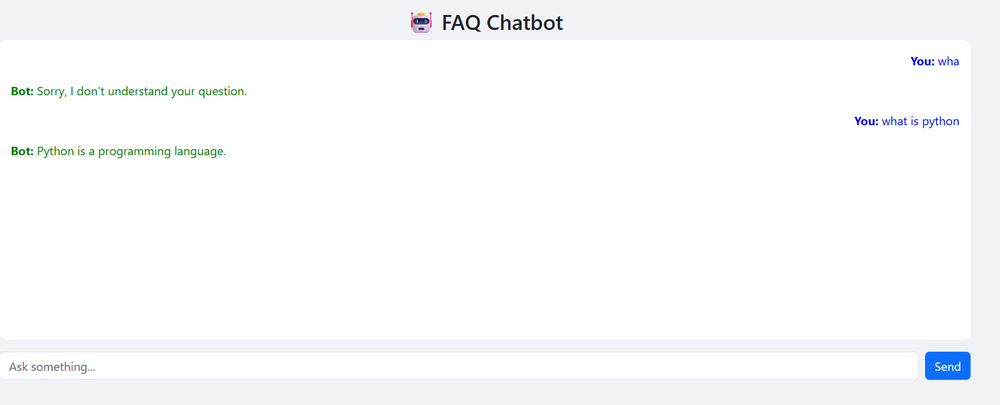

# CodeAlpha_FAQChatbot
# 🤖 FAQ Chatbot
This project is developed as part of my Artificial Intelligence Internship at CodeAlpha.
## 📌 Project Demo
This is a simple FAQ Chatbot that answers user questions based on predefined FAQs using Natural Language Processing (NLP) techniques. It uses TF-IDF vectorization and cosine similarity to find the best matching answer.
## 🚀 Features
✔️ User-friendly chat interface 💬  
✔️ Intelligent question matching using TF-IDF  
✔️ Cosine similarity for best answer selection  
✔️ Handles unknown questions ❌  
✔️ Chat history display 🕓  
## 🛠️ Technologies Used
- Python  
- Flask  
- HTML, CSS (Bootstrap)  
- Scikit-learn (TF-IDF, Cosine Similarity)  
## 📸 Screenshots

## ▶️ How to Run
1. Install dependencies:
